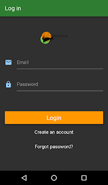
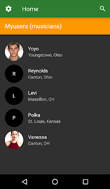
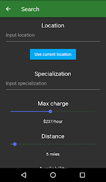
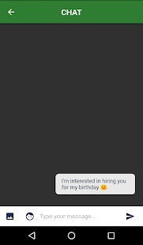

# myusica

  </a>
  
  

A mobile application for connecting people to musicians around them based on their needs. Built with Flutter with a Firebase backend database.

  Page Name | Image   
 --- | --- 
 Log in page | 
 Home page with musicians to hire | 
 Search by location | 
 Chat | 
  
App has been published for Android on Google Play [here](https://play.google.com/store/apps/details?id=com.levisoftwares.myusica&fbclid=IwAR2U7ZoUcRiduFDvCOCj65_tgc4tTaRl_hEXocEBvDaxDap6IK4bZ58GBHI)
